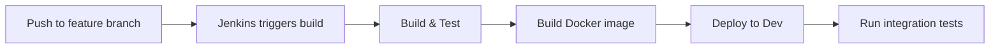
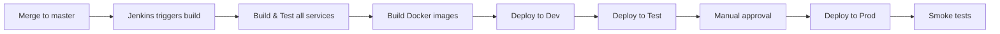

# Jenkins CI/CD Setup Guide

## Overview

This document provides comprehensive instructions for setting up Jenkins CI/CD pipelines for the Bank Application microservices deployment to Kubernetes.

## Architecture

The project includes 11 Jenkins pipelines:

### Individual Service Pipelines (10)
1. `accounts-service/Jenkinsfile`
2. `auth-server/Jenkinsfile`
3. `blocker-service/Jenkinsfile`
4. `cash-service/Jenkinsfile`
5. `exchange-service/Jenkinsfile`
6. `exchange-generator-service/Jenkinsfile`
7. `gateway-service/Jenkinsfile`
8. `front-ui/Jenkinsfile`
9. `notifications-service/Jenkinsfile`
10. `transfer-service/Jenkinsfile`

### Umbrella Pipeline (1)
- `Jenkinsfile` (root) - Builds and deploys entire application

## Prerequisites

### 1. Jenkins Installation

```bash
# Install Jenkins on Ubuntu/Debian
wget -q -O - https://pkg.jenkins.io/debian/jenkins.io.key | sudo apt-key add -
sudo sh -c 'echo deb http://pkg.jenkins.io/debian-stable binary/ > /etc/apt/sources.list.d/jenkins.list'
sudo apt update
sudo apt install jenkins openjdk-21-jdk

# Start Jenkins
sudo systemctl start jenkins
sudo systemctl enable jenkins
```

### 2. Required Jenkins Plugins

Install the following plugins via Jenkins UI (`Manage Jenkins` → `Plugin Manager`):

- **Kubernetes CLI Plugin** - For kubectl commands
- **Docker Pipeline Plugin** - For Docker operations
- **Pipeline Plugin** - For pipeline support
- **Git Plugin** - For Git repository integration
- **Pipeline Maven Integration Plugin** - For Maven builds
- **JUnit Plugin** - For test reporting
- **Credentials Binding Plugin** - For secret management

### 3. Required Tools on Jenkins Node

Ensure these tools are installed on the Jenkins agent:

```bash
# Java 21
sudo apt install openjdk-21-jdk

# Maven 3.9+
wget https://dlcdn.apache.org/maven/maven-3/3.9.5/binaries/apache-maven-3.9.5-bin.tar.gz
sudo tar xzf apache-maven-3.9.5-bin.tar.gz -C /opt
sudo ln -s /opt/apache-maven-3.9.5 /opt/maven
echo 'export PATH=/opt/maven/bin:$PATH' | sudo tee -a /etc/profile

# Docker
sudo apt install docker.io
sudo usermod -aG docker jenkins

# kubectl
curl -LO "https://dl.k8s.io/release/$(curl -L -s https://dl.k8s.io/release/stable.txt)/bin/linux/amd64/kubectl"
sudo install -o root -g root -m 0755 kubectl /usr/local/bin/kubectl

# Helm 3.x
curl https://raw.githubusercontent.com/helm/helm/main/scripts/get-helm-3 | bash
```

## Jenkins Configuration

### 1. Configure Credentials

Navigate to `Manage Jenkins` → `Credentials` → `System` → `Global credentials`

#### a. Docker Registry Credentials
- **Kind**: Username with password
- **ID**: `docker-registry-credentials`
- **Username**: Your Docker Hub username
- **Password**: Your Docker Hub password or access token
- **Description**: Docker Registry Credentials

#### b. Kubernetes Config
- **Kind**: Secret file
- **ID**: `kubeconfig`
- **File**: Upload your `~/.kube/config` file
- **Description**: Kubernetes Configuration

### 2. Configure Global Tools

Navigate to `Manage Jenkins` → `Global Tool Configuration`

#### a. Maven Configuration
- **Name**: Maven 3.9
- **Install automatically**: Check
- **Version**: 3.9.5

#### b. JDK Configuration
- **Name**: JDK 21
- **JAVA_HOME**: `/usr/lib/jvm/java-21-openjdk-amd64`

### 3. Configure Kubernetes Access

Create a Jenkins credential for Kubernetes:

```bash
# Copy kubeconfig to Jenkins credentials
kubectl config view --raw > /tmp/kubeconfig
```

Then upload this file as a Secret file credential in Jenkins with ID: `kubeconfig`

## Pipeline Setup

### Option 1: Individual Service Pipelines

Create separate Jenkins jobs for each microservice.

#### Steps:
1. Click **New Item** in Jenkins
2. Enter name: `bank-app-accounts-service`
3. Select **Pipeline**
4. Click **OK**

#### Pipeline Configuration:
- **General**
  - Description: `CI/CD pipeline for accounts-service`
  - Check **GitHub project** (if using GitHub)
  - Project URL: `https://github.com/your-org/bankapp`

- **Build Triggers**
  - Check **Poll SCM** or **GitHub hook trigger for GITScm polling**
  - Schedule (if using Poll SCM): `H/5 * * * *` (every 5 minutes)

- **Pipeline**
  - Definition: **Pipeline script from SCM**
  - SCM: **Git**
  - Repository URL: `https://github.com/your-org/bankapp.git`
  - Credentials: (select your Git credentials)
  - Branch Specifier: `*/master`
  - Script Path: `accounts-service/Jenkinsfile`

Repeat for all 10 microservices, changing the name and script path accordingly.

### Option 2: Umbrella Pipeline (Recommended)

Create a single pipeline that builds and deploys the entire application.

#### Steps:
1. Click **New Item** in Jenkins
2. Enter name: `bank-app-umbrella`
3. Select **Pipeline**
4. Click **OK**

#### Pipeline Configuration:
- **General**
  - Description: `Complete CI/CD pipeline for Bank Application`
  - Check **GitHub project**
  - Project URL: `https://github.com/your-org/bankapp`

- **Build Triggers**
  - Check **Poll SCM** or **GitHub hook trigger for GITScm polling**
  - Schedule: `H/5 * * * *`

- **Pipeline**
  - Definition: **Pipeline script from SCM**
  - SCM: **Git**
  - Repository URL: `https://github.com/your-org/bankapp.git`
  - Branch Specifier: `*/master`
  - Script Path: `Jenkinsfile`

### Option 3: Multibranch Pipeline (Best Practice)

Create a multibranch pipeline for automatic branch discovery.

#### Steps:
1. Click **New Item** in Jenkins
2. Enter name: `bank-app-multibranch`
3. Select **Multibranch Pipeline**
4. Click **OK**

#### Configuration:
- **Branch Sources**
  - Add source: **Git**
  - Project Repository: `https://github.com/your-org/bankapp.git`
  - Credentials: (select your Git credentials)
  - Discover branches: **All branches**

- **Build Configuration**
  - Mode: **by Jenkinsfile**
  - Script Path: `Jenkinsfile`

- **Scan Multibranch Pipeline Triggers**
  - Check **Periodically if not otherwise run**
  - Interval: `1 minute`

## Pipeline Stages Explained

### Individual Service Pipeline Stages

1. **Checkout** - Clone the repository
2. **Validate Helm Chart** - Lint the service's Helm chart
3. **Build Maven** - Compile Java code and package JAR
4. **Run Unit Tests** - Execute JUnit tests
5. **Build Docker Image** - Create Docker image with build number tag
6. **Push Docker Image** - Push image to Docker registry
7. **Deploy to Dev** - Deploy to `bank-app-dev` namespace
8. **Run Integration Tests - Dev** - Execute Helm tests in dev
9. **Deploy to Test** - Deploy to `bank-app-test` namespace (master branch only)
10. **Run Integration Tests - Test** - Execute Helm tests in test
11. **Approval for Production** - Manual approval gate (master branch only)
12. **Deploy to Production** - Deploy to `bank-app-prod` namespace
13. **Run Smoke Tests - Production** - Execute smoke tests in prod

### Umbrella Pipeline Stages

1. **Checkout** - Clone the repository
2. **Validate Umbrella Helm Chart** - Lint umbrella chart and update dependencies
3. **Build All Services** - Parallel Maven builds for all 10 services
4. **Run All Tests** - Execute all unit tests
5. **Build All Docker Images** - Parallel Docker builds for all services
6. **Push All Docker Images** - Push all images to registry
7. **Deploy to Dev** - Deploy complete application to dev
8. **Run Integration Tests - Dev** - Execute integration tests
9. **Deploy to Test** - Deploy to test environment (master only)
10. **Run Integration Tests - Test** - Execute integration tests
11. **Approval for Production** - Manual approval gate
12. **Deploy to Production** - Deploy to production
13. **Run Smoke Tests - Production** - Execute smoke tests
14. **Deployment Summary** - Display deployment information

## Kubernetes Namespaces

The pipelines deploy to three namespaces:

- **bank-app-dev** - Development environment (all branches)
- **bank-app-test** - Test environment (master branch only)
- **bank-app-prod** - Production environment (master branch with approval)

### Namespace Access Configuration

Ensure Jenkins has access to create and manage resources in these namespaces:

```bash
# Create namespaces
kubectl create namespace bank-app-dev
kubectl create namespace bank-app-test
kubectl create namespace bank-app-prod

# Create service account for Jenkins
kubectl create serviceaccount jenkins -n bank-app-dev
kubectl create serviceaccount jenkins -n bank-app-test
kubectl create serviceaccount jenkins -n bank-app-prod

# Create cluster role binding
kubectl create clusterrolebinding jenkins-admin \
  --clusterrole=cluster-admin \
  --serviceaccount=bank-app-dev:jenkins
```

## Environment Variables

Each pipeline uses these environment variables:

```groovy
SERVICE_NAME         // Service name (e.g., 'accounts-service')
DOCKER_REGISTRY      // Docker registry URL (default: 'docker.io')
DOCKER_IMAGE         // Full Docker image name
HELM_CHART_PATH      // Path to Helm chart
MAVEN_OPTS           // Maven options
```

## Customization

### Change Docker Registry

Edit the Jenkinsfile and modify:

```groovy
environment {
    DOCKER_REGISTRY = 'your-registry.com'
}
```

### Change Branch for Production Deployment

Modify the `when` condition:

```groovy
stage('Deploy to Production') {
    when {
        branch 'main'  // Change from 'master' to 'main'
    }
}
```

### Add Email Notifications

Add to the `post` section:

```groovy
post {
    failure {
        mail to: 'team@example.com',
             subject: "Build Failed: ${env.JOB_NAME} - ${env.BUILD_NUMBER}",
             body: "Check Jenkins for details: ${env.BUILD_URL}"
    }
    success {
        mail to: 'team@example.com',
             subject: "Build Successful: ${env.JOB_NAME} - ${env.BUILD_NUMBER}",
             body: "Deployment completed successfully"
    }
}
```

### Add Slack Notifications

Install the Slack Notification Plugin and add:

```groovy
post {
    always {
        slackSend(
            color: currentBuild.result == 'SUCCESS' ? 'good' : 'danger',
            message: "${env.JOB_NAME} - ${env.BUILD_NUMBER} ${currentBuild.result}"
        )
    }
}
```

## Deployment Workflow

### Development Workflow



### Production Workflow



## Troubleshooting

### Issue: Docker permission denied

```bash
# Add Jenkins user to docker group
sudo usermod -aG docker jenkins
sudo systemctl restart jenkins
```

### Issue: kubectl command not found

```bash
# Install kubectl and ensure it's in PATH
curl -LO "https://dl.k8s.io/release/$(curl -L -s https://dl.k8s.io/release/stable.txt)/bin/linux/amd64/kubectl"
sudo install -o root -g root -m 0755 kubectl /usr/local/bin/kubectl
```

### Issue: Helm chart not found

Ensure you're running from the repository root and the chart path is correct:

```groovy
HELM_CHART_PATH = 'helm/bank-app'  // Relative to repository root
```

### Issue: Maven build fails

Check Maven is configured correctly:

```bash
mvn --version
# Should show Maven 3.9+ and Java 21
```

### Issue: Kubernetes deployment timeout

Increase timeout in Jenkinsfile:

```groovy
helm upgrade --install ... --timeout 15m  // Increase from 5m to 15m
```

## Monitoring and Logging

### View Pipeline Logs

1. Navigate to the build in Jenkins
2. Click **Console Output**
3. Search for errors or warnings

### View Kubernetes Deployment Status

```bash
# Check pod status
kubectl get pods -n bank-app-dev

# View pod logs
kubectl logs -f <pod-name> -n bank-app-dev

# Describe pod for events
kubectl describe pod <pod-name> -n bank-app-dev
```

### View Helm Release Status

```bash
# List releases
helm list -A

# Check release status
helm status bank-app -n bank-app-dev

# View release history
helm history bank-app -n bank-app-dev
```

## Best Practices

1. **Use Multibranch Pipeline** - Automatically discovers and builds all branches
2. **Implement Manual Approval** - Always require approval before production deployment
3. **Run Tests** - Always run unit and integration tests before deployment
4. **Tag Images** - Use build numbers for Docker image tags for traceability
5. **Use Secrets** - Store sensitive data in Jenkins credentials, not in code
6. **Monitor Builds** - Set up notifications for build failures
7. **Clean Workspace** - Always clean workspace after builds to save disk space
8. **Parallel Builds** - Build services in parallel for faster pipelines
9. **Health Checks** - Wait for deployments to be healthy before proceeding
10. **Rollback Plan** - Use Helm rollback for failed deployments

## Rollback Procedure

If a deployment fails:

```bash
# List release history
helm history bank-app -n bank-app-prod

# Rollback to previous version
helm rollback bank-app <revision> -n bank-app-prod

# Or rollback to last successful deployment
helm rollback bank-app 0 -n bank-app-prod
```

## Security Considerations

1. **Credentials** - Never hardcode credentials in Jenkinsfiles
2. **RBAC** - Use Kubernetes RBAC to limit Jenkins permissions
3. **Docker Registry** - Use private Docker registry for production
4. **Network Policies** - Implement Kubernetes network policies
5. **Image Scanning** - Scan Docker images for vulnerabilities
6. **Secrets Management** - Use Kubernetes secrets for sensitive data

## Next Steps

1. Set up Jenkins according to this guide
2. Configure credentials for Docker and Kubernetes
3. Create pipeline jobs
4. Test with a feature branch deployment
5. Set up monitoring and alerting
6. Document your organization-specific procedures

## Support

For issues or questions:
- Check Jenkins console output
- Review Kubernetes events: `kubectl get events -n <namespace>`
- Check pod logs: `kubectl logs <pod-name> -n <namespace>`
- Review Helm chart: `helm get values <release> -n <namespace>`

## Additional Resources

- [Jenkins Documentation](https://www.jenkins.io/doc/)
- [Kubernetes Documentation](https://kubernetes.io/docs/)
- [Helm Documentation](https://helm.sh/docs/)
- [Docker Documentation](https://docs.docker.com/)
- [Maven Documentation](https://maven.apache.org/guides/)
